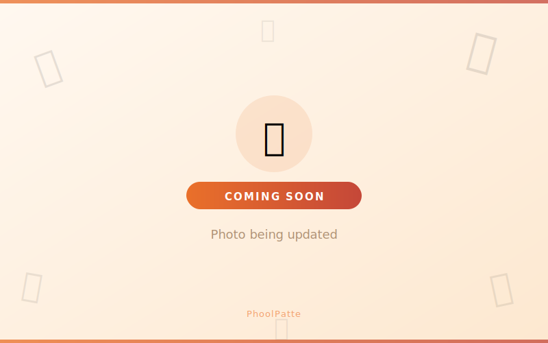

# 🌸 PhoolPatte — Flowers for Every Function

> Delhi NCR's premium flower shop — Jaimala, Varmala, Phoolon ki Chadar, Flower Jewellery, Bulk Flowers & Function Decoration.



---

## 🌺 About

**PhoolPatte** is a modern, mobile-first flower e-commerce web app built for Delhi NCR customers. Customers can browse collections, add to cart, wishlist products, and place orders directly via WhatsApp — no backend needed.

Built with **vanilla HTML, CSS & JavaScript** — zero frameworks, zero dependencies, fully static.

---

## ✨ Features

- 🛍️ **Product Catalog** — Browse by category with filters
- 🛒 **Cart & Wishlist** — Persistent via localStorage
- 💬 **WhatsApp Ordering** — One-tap order with pre-filled message
- 🤖 **Built-in Chatbot** — Answers common queries instantly
- 📱 **Phone Gate** — Collects customer WhatsApp number for order tracking
- 🎨 **Custom Orders** — Dedicated category for bespoke flower arrangements
- 🚚 **Delivery Info** — Coverage across all Delhi NCR areas
- 🎊 **Occasions Page** — Quick WhatsApp shortcuts by function type
- 🔖 **Wishlist + Likes** — SVG bookmark icons, persistent across sessions
- 📄 **404 Page** — Branded not-found page with navigation
- 📦 **Coming Soon placeholders** — SVG placeholders until real photos are uploaded

---

## 🗂️ Project Structure

```
phoolpatte/
├── index.html              ← Main entry point
├── 404.html                ← Branded not-found page
│
├── css/
│   └── styles.css          ← All styles (saffron/rose/cream palette)
│
├── js/
│   ├── config.js           ← ⚠️ Credentials (WA number, Instagram, Cloudinary)
│   ├── data.js             ← Products, categories, testimonials, chatbot KB
│   ├── state.js            ← Cart, wishlist, likes (localStorage)
│   ├── ui.js               ← Navbar, modal, chatbot, card components
│   ├── pages.js            ← Page render functions (home, catalog, cart, etc.)
│   └── router.js           ← Client-side hash router
│
└── images/
    └── coming_soon.svg     ← Placeholder until Cloudinary images are uploaded
```

---

## ⚙️ Setup

### 1. Clone the repo
```bash
git clone https://github.com/yourusername/phoolpatte.git
cd phoolpatte
```

### 2. Configure credentials
Copy the example config and fill in your details:
```bash
cp js/config.example.js js/config.js
```

Edit `js/config.js`:
```js
var WA_NUMBER        = '91XXXXXXXXXX';   // Your WhatsApp number (91 + 10 digits)
var INSTAGRAM_URL    = 'https://instagram.com/yourhandle';
var INSTAGRAM_HANDLE = '@yourhandle';
var CLOUDINARY_CLOUD = 'your_cloud_name';
```

### 3. Open in browser
No build step needed. Just open `index.html` in a browser.

> 💡 Use **VS Code Live Server** extension for the best local dev experience — avoid opening `index.html` directly via `file://` as some browsers restrict local JS loading.

---

## 🖼️ Images

Product and category images are hosted on **Cloudinary**. The `cloudImg()` helper in `config.js` generates optimised URLs automatically:

```js
// Auto-crops, sharpens and serves WebP
cloudImg('your_public_id', 800, 500)
```

Until you upload your own photos, a branded **"Coming Soon"** SVG placeholder is shown.

---

## 🛒 How Ordering Works

1. Customer browses and adds products to cart
2. Fills delivery address + date on the purchase page
3. Clicks **"Send Order on WhatsApp"**
4. WhatsApp opens with a fully pre-filled order message
5. You confirm and process — no payment gateway needed

---

## 📦 Script Load Order

The `index.html` loads scripts in this exact order (do not change):

| # | File | Purpose |
|---|------|---------|
| 0 | `config.js` | Credentials & constants |
| 1 | `data.js` | All content (products, categories) |
| 2 | `state.js` | localStorage state management |
| 3 | `ui.js` | UI components (navbar, modal, chatbot) |
| 4 | `pages.js` | Page renderers |
| 5 | `router.js` | Hash-based client router |

---

## 🎨 Design System

| Token | Value | Usage |
|-------|-------|-------|
| `--saffron` | `#E8651A` | Primary CTA, accents |
| `--rose` | `#C0392B` | Hover states, gradients |
| `--cream` | `#FFF8F0` | Page backgrounds |
| `--dark` | `#1A1008` | Headings |
| `--mid` | `#5A4030` | Body text |

Fonts: **Playfair Display** (headings) · **Kalam** (Hindi/decorative) · **DM Sans** (body)

---

## 🚀 Deployment

This is a fully static site — deploy anywhere:

- **GitHub Pages** — push to `main`, enable Pages in repo settings
- **Netlify** — drag and drop the folder
- **Vercel** — `vercel --prod`

> ⚠️ Make sure `js/config.js` is in `.gitignore` before pushing to a public repo. Use `config.example.js` as a safe template to commit instead.

---

## 📍 Delivery Coverage

Delhi · Noida · Greater Noida · Gurgaon · Faridabad · Ghaziabad · Dadri · Bahadurgarh · Sonipat · Rohini · Dwarka · Lajpat Nagar

---

## 📸 Categories

| Category | Hindi |
|----------|-------|
| Custom Orders | कस्टमाइज़ करें |
| Jaimala / Varmala | जयमाला / वरमाला |
| Phoolon ki Chadar | फूलों की चादर |
| Bouquets | बुके |
| Flower Jewellery | फूल ज्वेलरी |
| Bulk Loose Flowers | थोक / मंदिर के फूल |
| Haldi / Mehendi Décor | हल्दी / मेहंदी डेकोर |

---

## 🤝 Contributing

This is a private business project. Feel free to fork it for your own flower shop — just change the branding, WhatsApp number and product data in `config.js` and `data.js`.

---

## 📄 License

MIT — free to use and adapt with attribution.

---

*Made with 🌸 for every function in Delhi NCR*
